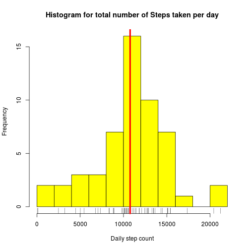
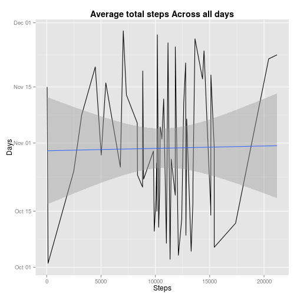
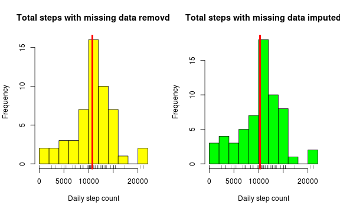
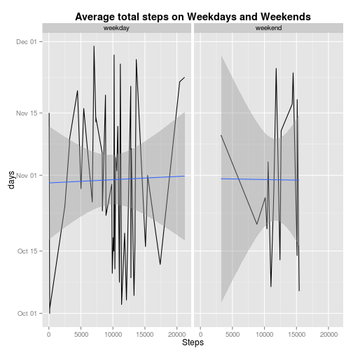

# Overview

This analysis makes use of data from a personal activity monitoring device, such as a Fitbit, Nike Fuelband, or Jawbone Up. These type of devices are part of the “quantified self” movement – a group of enthusiasts who take   measurements about themselves regularly to improve their health, to find patterns in their behavior, or because they are tech geeks. But these data remain under-utilized both because the raw data are hard to obtain and there 
is a lack of statistical methods and software for processing and interpreting the data. This script Calculate the total number of steps taken per day, calculate and report the mean and median of the total number of steps, plots histogram of the total number of steps, shows average daily activity pattern,  method that impute missing values from the data and Make a panel plot containing a time series plots. 

## Q-1 Loading and preprocessing the data


```r
# Download and save the file in data directory
if(!file.exists("./data")){dir.create("./data")}
fileUrl <- "https://d396qusza40orc.cloudfront.net/repdata%2Fdata%2Factivity.zip"
download.file(fileUrl, destfile = "./data/Factivity.zip", method = "curl")
unzip("./data/Factivity.zip")
```

### Process/transform the data (if necessary) into a format suitable for your analysis

```r
library(dplyr)

actvty <- read.csv("activity.csv") #data frame in active directory
actvty <- tbl_df(actvty) # convert df to dt
actvty1 <- na.omit(actvty)  # remove missing rows from the data frame
actvty1 <- select(actvty1, date, interval, steps)       # rearrange the data columns
actvty1 <- actvty1 %>%
        group_by(date) %>% 
                summarise_each(funs(sum), steps) # use dplyr to sum steps each day
str(actvty1)
```

```
## Classes 'tbl_df', 'tbl' and 'data.frame':	53 obs. of  2 variables:
##  $ date : Factor w/ 61 levels "2012-10-01","2012-10-02",..: 2 3 4 5 6 7 9 10 11 12 ...
##  $ steps: int  126 11352 12116 13294 15420 11015 12811 9900 10304 17382 ...
##  - attr(*, "na.action")=Class 'omit'  Named int [1:2304] 1 2 3 4 5 6 7 8 9 10 ...
##   .. ..- attr(*, "names")= chr [1:2304] "1" "2" "3" "4" ...
```

```r
head(actvty1)
```

```
## Source: local data frame [6 x 2]
## 
##         date steps
##       (fctr) (int)
## 1 2012-10-02   126
## 2 2012-10-03 11352
## 3 2012-10-04 12116
## 4 2012-10-05 13294
## 5 2012-10-06 15420
## 6 2012-10-07 11015
```

##Q-2 What is mean total number of steps taken per day?


```r
TotalSteps <- actvty1$steps 
summary(TotalSteps) 
```

```
##    Min. 1st Qu.  Median    Mean 3rd Qu.    Max. 
##      41    8841   10760   10770   13290   21190
```


### Calculate the total number of steps taken per day

```r
sum(actvty1$steps)
```

```
## [1] 570608
```
The total number steps take is 570608.

### Make a histogram of the total number of steps taken each day
#### Figure 1: A histogram for 10/12 & 11/2

```r
actvtyHist <- hist(actvty1$steps,  breaks = 15, freq = T, col = "yellow", 
                   main = "Histogram for total number of Steps taken per day",
                   xlab = "Daily step count", ylab ="Frequency")
rug(actvty1$steps) # rug under the histogram to show step concentration
abline(v = mean(actvty1$steps), col = "red", lwd = 4)
```

 

### Calculate and report the mean and median of the total number of steps taken per day

```r
TotalSteps <- actvty1$steps 
summary(TotalSteps) 
```

```
##    Min. 1st Qu.  Median    Mean 3rd Qu.    Max. 
##      41    8841   10760   10770   13290   21190
```

##Q-3 What is the average daily activity pattern?
### Make a time series plot on the average number of steps taken

Loading and preprocessing the data for the time series plot

```r
library(ggplot2)

str(actvty)
```

```
## Classes 'tbl_df', 'tbl' and 'data.frame':	17568 obs. of  3 variables:
##  $ steps   : int  NA NA NA NA NA NA NA NA NA NA ...
##  $ date    : Factor w/ 61 levels "2012-10-01","2012-10-02",..: 1 1 1 1 1 1 1 1 1 1 ...
##  $ interval: int  0 5 10 15 20 25 30 35 40 45 ...
```

```r
actvty$date <- as.Date(actvty$date)
actvty2sum <- actvty %>% 
        group_by(date) %>% 
                    summarise_each(funs(sum), steps) # sum the steps for each day
actvty2sum <- na.omit(actvty2sum)      #remove rows with unavilable data - NA
head(actvty2sum)
```

```
## Source: local data frame [6 x 2]
## 
##         date steps
##       (date) (int)
## 1 2012-10-02   126
## 2 2012-10-03 11352
## 3 2012-10-04 12116
## 4 2012-10-05 13294
## 5 2012-10-06 15420
## 6 2012-10-07 11015
```

####Figure 2: A Time series plot for the total Steps Across all days

```r
qplot(steps, date, data = actvty2sum, geom = c("line", "smooth"), method ="lm") + 
        ggtitle("Average total steps Across all days") + 
        labs( x = "Steps", y = "Days") +
        theme(plot.title = element_text(lineheight=.8, face="bold")) 
```

 

### Which 5-minute interval contains the maximum number of steps?
 

```r
 summary(actvty)
```

```
##      steps             date               interval     
##  Min.   :  0.00   Min.   :2012-10-01   Min.   :   0.0  
##  1st Qu.:  0.00   1st Qu.:2012-10-16   1st Qu.: 588.8  
##  Median :  0.00   Median :2012-10-31   Median :1177.5  
##  Mean   : 37.38   Mean   :2012-10-31   Mean   :1177.5  
##  3rd Qu.: 12.00   3rd Qu.:2012-11-15   3rd Qu.:1766.2  
##  Max.   :806.00   Max.   :2012-11-30   Max.   :2355.0  
##  NA's   :2304
```

```r
 filter(actvty, steps ==806)
```

```
## Source: local data frame [1 x 3]
## 
##   steps       date interval
##   (int)     (date)    (int)
## 1   806 2012-11-27      615
```

##Q-4 Imputing missing values
To impute value for missing data a numberof model/techhniques. For this excersie we are using the **Last value carried forward _(LOCF)_** technique.  The last observed value is used to fill in missing values in subsequent observations, this method assums that the most recent observation is the best guess for subsequent missing values. We are using the R **_ZOO_** package's **na.locf** function.
### Prepare the data 

```r
actvty3 <- read.csv("activity.csv")                #data frame in active directory

actvty3 <- actvty3 %>%
             group_by(date) %>% 
                summarise_each(funs(sum), steps)   # sum of  steps each day

actvty3 <- actvty3 %>%
        group_by(date) %>% 
        summarise_each(funs(sum), steps)           # sum of  steps each day
```
### Calculate and report the total number of missing values in the dataset

```r
sum(is.na(actvty3)) # how many days of misseang value
```

```
## [1] 8
```

```r
mean(is.na(actvty3)) 
```

```
## [1] 0.06557377
```
#### Does the presence of missing days introduce bias?
The following plot shows that t.....
> sum(is.na(actvty3))
[1] 8
> mean(is.na(actvty3))
[1] 0.06557377
> 

### Impute missing values in the dataset

```r
library(zoo)
actvty3 <- read.csv("activity.csv")  
actvty33 <- na.locf(actvty3, na.rm = FALSE) #replace NA with the Last Value from the top down
actvty333 <- na.locf(actvty33, na.rm = FALSE, fromLast = TRUE) # NA replace from the last data point to complete the cricle
```
#### Confirming Imputed value remove all NA

```r
sum(is.na(actvty333)) # how many days of misseang value
```

```
## [1] 0
```

```r
mean(is.na(actvty333)) 
```

```
## [1] 0
```
### Create a new dataset that is equal to the original dataset but with the missing data filled in.

```r
actvty333 <- tbl_df(actvty333)
str(actvty333)
```

```
## Classes 'tbl_df', 'tbl' and 'data.frame':	17568 obs. of  3 variables:
##  $ steps   : chr  "  0" "  0" "  0" "  0" ...
##  $ date    : chr  "2012-10-01" "2012-10-01" "2012-10-01" "2012-10-01" ...
##  $ interval: chr  "   0" "   5" "  10" "  15" ...
```

```r
sum(is.na(actvty333))
```

```
## [1] 0
```

### Make a histogram of the total number of steps taken each day and Calculate and report the mean and median total number of steps taken per day.
#### Prepare the data table for comarative histogram plot

```r
#change variable data types 
actvty333$date <- as.Date(actvty333$date)
actvty333$interval <- as.numeric(actvty333$interval)
actvty333$steps <- as.numeric(actvty333$steps)

actvty333sum <- actvty333 %>%
                  group_by(date) %>% 
                     summarise_each(funs(sum), steps) # sum of  steps each day
```

#### Figure 3: Side by side comparison of total steps with missing and imputed data.

```r
par(mfrow = c(1,2))

actvtyHist <- hist(actvty1$steps,  breaks = 15, freq = T, col = "yellow", 
                   main = "Total steps with missing data removd",
                   xlab = "Daily step count", ylab ="Frequency")
                   rug(actvty1$steps)
                   abline(v = mean(actvty1$steps), col = "red", lwd = 4)

actvtyHist3 <- hist(actvty333sum$steps,  breaks = 15, freq = T, col = "Green", 
                    main = "Total steps with missing data imputed",
                    xlab = "Daily step count", ylab ="Frequency")
                    rug(actvty333sum$steps)
                    abline(v = mean(actvty333sum$steps), col = "red", lwd = 4)
```

 


##Q-5 Are there differences in activity patterns between weekdays and weekends?
### Preparing the data table for weekday/weekend activty pattern comparison

```r
actvtyWK <- actvty333sum  %>% mutate( DaysOfWk = weekdays(as.Date(date))) # Add coresponding weekday
str(actvtyWK)
```

```
## Classes 'tbl_df', 'tbl' and 'data.frame':	61 obs. of  3 variables:
##  $ date    : Date, format: "2012-10-01" "2012-10-02" ...
##  $ steps   : num  0 126 11352 12116 13294 ...
##  $ DaysOfWk: chr  "Monday" "Tuesday" "Wednesday" "Thursday" ...
```

```r
head(actvtyWK, 10)
```

```
## Source: local data frame [10 x 3]
## 
##          date steps  DaysOfWk
##        (date) (dbl)     (chr)
## 1  2012-10-01     0    Monday
## 2  2012-10-02   126   Tuesday
## 3  2012-10-03 11352 Wednesday
## 4  2012-10-04 12116  Thursday
## 5  2012-10-05 13294    Friday
## 6  2012-10-06 15420  Saturday
## 7  2012-10-07 11015    Sunday
## 8  2012-10-08     0    Monday
## 9  2012-10-09 12811   Tuesday
## 10 2012-10-10  9900 Wednesday
```

### Create a new factor variable with two levels – “weekday” and “weekend” 

```r
actvtyWKD <- actvtyWK %>%  mutate(TypeOfDay = ifelse(DaysOfWk == "Saturday" | DaysOfWk =="Sunday", "weekend", "weekday" )) # add weekday & weekend variable 

actvtyWKD[actvtyWKD == 0] <- NA  # convert 0 value data to NA
actvtyWKD1 <- na.locf(actvtyWKD, na.rm = FALSE) #replace NA with the Last Value from the top down
actvtyWKD2 <- na.locf(actvtyWKD1, na.rm = FALSE, fromLast = TRUE) # NA replace from the last data point to complete the cricle

# #change variable data types 
actvtyWKD2$TypeOfDay <- as.factor(actvtyWKD2$TypeOfDay)
actvtyWKD2$DaysOfWk <- as.factor(actvtyWKD2$DaysOfWk) 
actvtyWKD2$steps <- as.numeric(actvtyWKD2$steps)
actvtyWKD2$date <- as.Date(actvtyWKD2$date)

str(actvtyWKD2)
```

```
## Classes 'tbl_df', 'tbl' and 'data.frame':	61 obs. of  4 variables:
##  $ date     : Date, format: "2012-10-01" "2012-10-02" ...
##  $ steps    : num  126 126 11352 12116 13294 ...
##  $ DaysOfWk : Factor w/ 7 levels "Friday","Monday",..: 2 6 7 5 1 3 4 2 6 7 ...
##  $ TypeOfDay: Factor w/ 2 levels "weekday","weekend": 1 1 1 1 1 2 2 1 1 1 ...
```

```r
head(actvtyWKD2, 10)
```

```
## Source: local data frame [10 x 4]
## 
##          date steps  DaysOfWk TypeOfDay
##        (date) (dbl)    (fctr)    (fctr)
## 1  2012-10-01   126    Monday   weekday
## 2  2012-10-02   126   Tuesday   weekday
## 3  2012-10-03 11352 Wednesday   weekday
## 4  2012-10-04 12116  Thursday   weekday
## 5  2012-10-05 13294    Friday   weekday
## 6  2012-10-06 15420  Saturday   weekend
## 7  2012-10-07 11015    Sunday   weekend
## 8  2012-10-08 11015    Monday   weekday
## 9  2012-10-09 12811   Tuesday   weekday
## 10 2012-10-10  9900 Wednesday   weekday
```

#### What is the impact of imputing missing data on the estimates of the total daily number of steps?

```r
AddSteps = sum(actvtyWKD2$steps) - sum(actvty1$steps)
T =  AddSteps / sum(actvty1$steps) * 100
```
The imputed data with locf technique added 5.7947 &times; 10<sup>4</sup> additional steps.Which is 10.155308 % more, and this could add a slight bias in the analysis.  

### Make a time series plot the average number of steps taken, averaged across all weekday days or weekend days
#### Figure 4: Weekdays Vs Weekend time series plot 

```r
qplot(steps, date, data = actvtyWKD2, geom = c("line", "smooth"), method ="lm",facets = .~TypeOfDay) + 
        ggtitle("Average total steps on Weekdays and Weekends") + 
        labs( x = "Steps", y = "days") +
        theme(plot.title = element_text(lineheight=.8, face="bold"))
```

 

# Over all observation

-  The volunteer on this observation has a more even distribution of steps taken thru out the week. The individual walk less on the beggining of the week increasing walking activity towards the end of the week.  
-  For the observed data, the weekend to week day walking activity comparison show about the same level.
- The imputed data with locf technique added 5.7947 &times; 10<sup>4</sup> additional steps. Which is 10.155308 % more. This could add a slight bias in the analysis, however the model factors in somemarigin of error.  
-  November 27, the 615th interval contains the maximum number of steps.
- The total number steps take not including the missing data is 570608.


